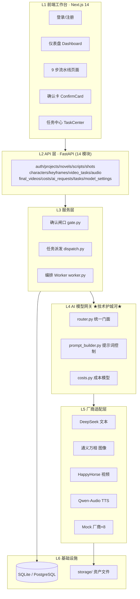
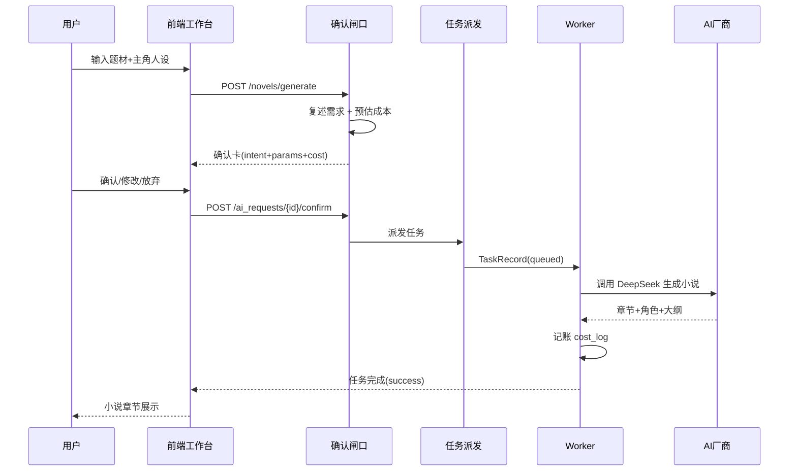
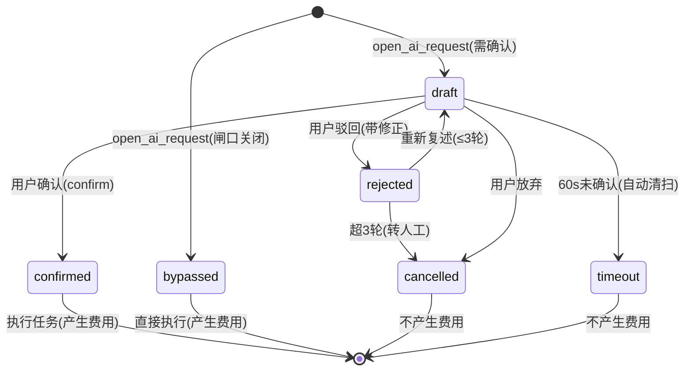
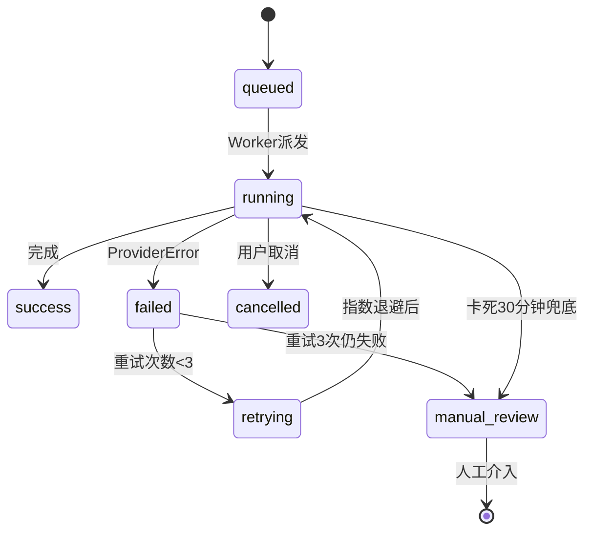
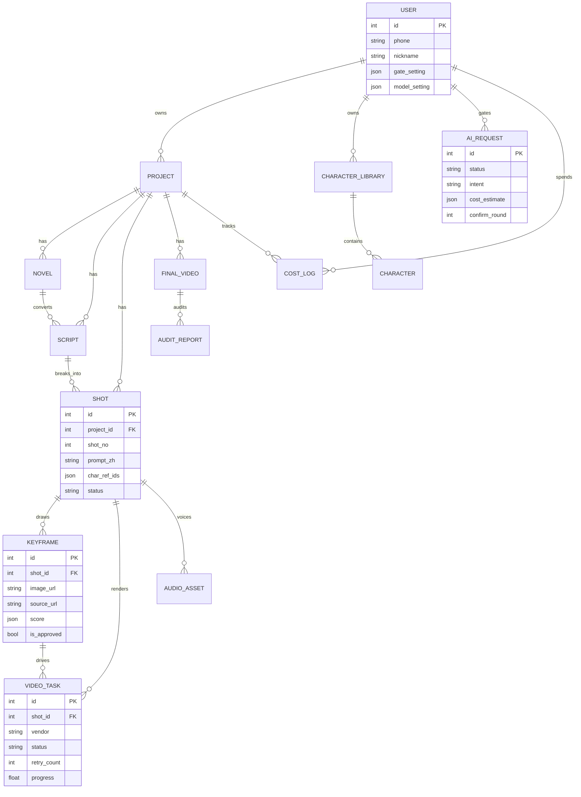

# 漫镜工场 ManJu Studio（trae 版）· 项目深度报告

> **项目名称**：漫镜工场 ManJu Studio — AI 漫剧工业化生产平台
> **代码版本**：v1.3.0（git 主干 10 个提交）
> **报告日期**：2026-08-08
> **代码规模**：后端 Python 约 6,479 行 / 前端 TypeScript 约 3,521 行 / 15 张数据表 / 14 个 API 模块 / 12 个前端页面

---

## 目录

1. [执行摘要](#1-执行摘要)
2. [项目定位与核心价值](#2-项目定位与核心价值)
3. [系统架构全景](#3-系统架构全景)
4. [核心机制深度解析](#4-核心机制深度解析)
   - 4.1 确认闸口（成本安全闸）
   - 4.2 AI 模型网关（技术护城河）
   - 4.3 成本模型与预算护栏（公式）
   - 4.4 任务编排引擎（状态机 + 指数退避）
   - 4.5 提示词工程（角色一致性）
   - 4.6 数据库幂等迁移
5. [数据模型](#5-数据模型)
6. [真实 AI 厂商接入](#6-真实-ai-厂商接入)
7. [前端工作台](#7-前端工作台)
8. [部署教程（完整版）](#8-部署教程完整版)
9. [测试与质量保障](#9-测试与质量保障)
10. [关键数字与性能指标](#10-关键数字与性能指标)
11. [风险分析与改进建议](#11-风险分析与改进建议)

---

## 1. 执行摘要

**漫镜工场（trae 版）是一个已打通"小说 → 成片"全链路的 AI 漫剧工业化生产平台。** 与仅停留在演示层（Mock 厂商）的原型不同，该版本已经完成了**真实 AI 厂商接入**（DeepSeek 文本 / 通义万相图像 / HappyHorse 视频 / Qwen-Audio TTS），并通过 9 步流水线实现了从一句话题材到可发布成片的端到端生产。

**开发方式**：在这次项目中，我们全程使用 **Trae 和 WorkBuddy** 进行 **Vibecoding**，轻松搞定了一站式闭环——从早期的行业调查、痛点分析，到后期的 PRD 生成和平台搭建。为了防止 Vibecoding 带来的偶然性偏差，我们还严格使用 **Git 进行版本管理**，让每一次迭代都有迹可循，大大提升了项目的确定性。

**三大设计亮点**：

| 机制 | 解决的问题 | 实现位置 |
|------|-----------|---------|
| **确认闸口** | AI 生成不可控、费用不可知 | `backend/app/core/gate.py` |
| **AI 模型网关** | 多厂商 API 碎片化、降级困难 | `backend/app/gateway/router.py` |
| **进程内任务编排** | 长时任务（视频生成 30 分钟）阻塞 | `backend/app/tasks/worker.py` |

**交付成熟度**：功能完整度约 **85%**，已具备本地可部署、可使用的条件；Mock/真实双模式切换使其既能零成本演示，也能真实生产。

---

## 2. 项目定位与核心价值

### 2.1 业务痛点

传统 AI 漫剧制作的三大难题：

1. **角色一致性差** — 同一角色跨镜头"变脸"，无法商用
2. **多镜头拼接难** — 单镜头生成容易，镜头间风格/角色统一极难
3. **成本不透明** — AI 调用失控，一个项目可能产生数千元不可预知费用

### 2.2 平台答案

```
一句话题材 → AI 小说 → 结构化剧本 → 角色资产库 → 分镜设计 → 关键帧抽卡
                                                          ↓
                                    成片 ← 剪辑合成 ← 配音 ← 多镜头视频
```

**核心价值主张**：AI 负责生成，人负责选择和管理；成本全程透明，确认前零计费。

---

## 3. 系统架构全景

### 3.1 分层架构



### 3.2 9 步流水线时序



### 3.3 技术栈总览

| 层 | 技术选型 | 版本 | 说明 |
|----|---------|------|------|
| 前端框架 | Next.js (App Router) | 14 | React 18 + Zustand + Tailwind |
| 后端框架 | FastAPI | - | Python 3.10+ |
| ORM | SQLAlchemy 2.x | - | + Pydantic 2.x 校验 |
| 数据库 | SQLite（默认）/ PostgreSQL | - | 便携 → 生产可切换 |
| 任务队列 | 进程内 asyncio Worker | - | 演示版 Celery 语义 |
| AI 文本 | DeepSeek V4 Flash | - | OpenAI 兼容接口 |
| AI 图像 | 通义万相 wan2.7-image-pro | - | DashScope 异步任务 |
| AI 视频 | HappyHorse 1.1 i2v | - | DashScope 异步任务 |
| AI 语音 | Qwen-Audio TTS Plus | - | DashScope 同步接口 |

---

## 4. 核心机制深度解析

### 4.1 确认闸口（成本安全闸）

**设计哲学**：任何 AI 生成/编辑/续写请求，必须**先结构化复述需求并预估成本**，经用户确认后才执行；**未确认前不调用任何付费接口、不产生算力消耗**。

#### 4.1.1 闸口判定逻辑（`gate.py::evaluate_gate`）

$$
\text{required} = \begin{cases}
\text{true} & \text{if } C_{high} \geq 50 \quad\text{（高成本护栏）}\\
\text{true} & \text{if } N_{batch} \geq 20 \quad\text{（批量护栏）}\\
\text{false} & \text{if } \neg G_{global} \quad\text{（全局开关关闭）}\\
\text{false} & \text{if } M \in D_{modules} \quad\text{（模块级关闭）}\\
\text{false} & \text{if } S_{session} \quad\text{（会话级关闭）}\\
\text{true} & \text{otherwise（默认需确认）}
\end{cases}
$$

> 其中：$C_{high}$ = 预估成本上限（元），$N_{batch}$ = 批量任务数，$G_{global}$ = 用户全局闸口开关，$D_{modules}$ = 模块级禁用集合，$S_{session}$ = 会话级禁用标志。

**关键设计**：护栏优先级最高——即使关闭所有开关，**≥50 元或 ≥20 镜头的任务仍强制确认**（防呆）。

#### 4.1.2 闸口状态机



#### 4.1.3 三级开关设计

| 层级 | 存储 | 生效范围 | 持久性 |
|------|------|---------|--------|
| 全局 | `user.gate_setting.global_enabled` | 所有模块 | 持久 |
| 模块 | `user.gate_setting.modules_disabled` | 指定模块 | 持久 |
| 会话 | 内存 `_session_state[session_id]` | 当前浏览器会话 | 刷新失效 |

会话级状态用 `threading.Lock` 保护的内存字典实现——**重启即恢复安全态**，防止误操作永久关闭。

### 4.2 AI 模型网关（技术护城河）

**架构原则**：业务层禁止直连厂商——一律经网关。

#### 4.2.1 双模式切换

```
MOCK_MODE = true  →  Mock 厂商(8个)     → 零成本演示,全流程可跑
MOCK_MODE = false →  DeepSeek/万相/HappyHorse/Qwen-Audio → 真实生产
```

切换点集中在 `router.py` 每个生成方法：

```python
def generate_novel(self, ...):
    if not settings.MOCK_MODE:
        data = deepseek_llm.generate_novel_full(...)
    else:
        outline = mock_llm.generate_novel_outline(...)
```

#### 4.2.2 厂商路由表

| 模块 | 厂商优先级（主→备） | 同步/异步 |
|------|-------------------|----------|
| 文本（小说/剧本/分镜） | deepseek_v3 → qwen_max | 同步 |
| 图像（角色/关键帧） | wanxiang → jimeng | 异步任务 |
| 视频 | vidu_q3 → seedance_2_0 → kling_2_0 | 异步任务 |
| TTS | doubao_tts → cosyvoice | 同步 |
| 内容安全 | aliyun_sec | 同步 |

#### 4.2.3 模型服务设置（用户可自选）

`MODEL_CATALOG` 定义各模块可选模型，用户偏好存于 `user.model_setting`（JSON），经 `model_overrides` 参数透传到网关：

$$
\text{model} = \text{overrides}[key] \;\; ?? \;\; \text{env\_default}
$$

空值或缺失回退 `.env` 默认模型——**用户可选 + 系统兜底**。

### 4.3 成本模型与预算护栏（公式）

#### 4.3.1 成本预估公式（`costs.py::estimate`）

预估区间以单价 × 数量为核心，上下浮动：

$$
C_{low} = 0.9 \times u \times q, \qquad C_{high} = 1.2 \times u \times q
$$

其中 $u$ = 单价，$q$ = 数量，数量 $q$ 按模块维度计算：

$$
q = \begin{cases}
\max(\text{tokens}, \text{chars}) / 1000 & \text{文本/语音类} \\
\text{duration} & \text{视频/渲染类} \\
\text{count} & \text{图像/音乐/审核类}
\end{cases}
$$

#### 4.3.2 单价表（PRICING）

| 维度 | 厂商 | 单价 |
|------|------|------|
| 文本 | deepseek_v3 | ¥0.002 / 千 token |
| 图像 | wanxiang | ¥0.50 / 张 |
| 视频 | seedance_2_0 | ¥0.80 / 秒 |
| 视频 | kling_2_0 | ¥1.50 / 秒 |
| TTS | doubao_tts | ¥0.03 / 千字符 |
| 渲染 | ffmpeg（自建） | ¥0.05 / 秒 |

> 与 PRD 目标「单分钟成片成本 ≤500 元」量级一致：60 秒视频 ≈ 12 镜头 × 5 秒 × ¥0.8 ≈ ¥48（视频）+ 图像/文本/TTS 附加。

#### 4.3.3 预算护栏判定（`check_budget`）

$$
\text{blocked} \iff \left( S \geq L \right) \;\lor\; \left( \frac{S + C_{high}}{L} \geq 1 \right)
$$

$$
\text{warn} \iff 0.8 \leq \frac{S}{L} < 1
$$

> $S$ = 项目已花费，$L$ = 预算上限，$C_{high}$ = 本次预估成本上限。
> **语义**：花费已达上限，或本次执行后将超过上限 → 拒绝创建计费任务。

#### 4.3.4 记账粒度

`cost_log` 表按 **（用户 × 项目 × 模块 × 镜头）** 记录，支持任意维度聚合：

$$
S_{project} = \sum_{\text{cost\_log where project\_id}} amount
$$

### 4.4 任务编排引擎（状态机 + 指数退避）

#### 4.4.1 任务状态机（PRD 6.2）



#### 4.4.2 指数退避公式

重试间隔：

$$
\text{delay}_n = 2^n \text{ 秒}, \quad n = 1, 2, 3
$$

即 2s → 4s → 8s，**第 4 次失败转人工**（`manual_review`）。

#### 4.4.3 厂商自动降级

主厂商失败后自动切换备选（`jobs.py::_next_vendor`）：

$$
\text{vendor}_{next} = \text{priority}\left[ (i_{current} + 1) \bmod |\text{priority}| \right]
$$

实现为循环队列：`vidu_q3 → seedance_2_0 → kling_2_0 → vidu_q3...`

#### 4.4.4 Worker 调度策略

- **派发**：扫描 `queued/retrying` 任务 → 创建 asyncio 协程
- **并发限制**：`_MAX_CONCURRENT_RECORDS = 2`（避免触发厂商 API 429 限流）
- **超时清扫**：60s 未确认的闸口记录 → `timeout`（不产生费用）
- **卡死兜底**：`running` 超 30 分钟且无对应协程 → `manual_review`

> **设计决策**：进程内 Worker 而非 Celery，是「演示版 Celery」——业务语义不变（queued/retrying/success/failed/manual_review 状态机 + 指数退避 + 并发限制），生产环境替换为 Celery+Redis 只需改 worker 调度层。

### 4.5 提示词工程（角色一致性）

#### 4.5.1 一致性控制三原则（`prompt_builder.py`）

1. **角色一致性块**：所有涉及角色的生成都引用同一份 `character_block(name, appearance, personality)`，强制约束"发型/发色/瞳色/面部特征/服饰/体型完全不变"
2. **风格一致性**：全局 `STYLE_HINT`（漫画分镜风格，电影级光影）贯穿所有图片
3. **同 seed 联动**：表情生成使用与选中三视图**相同的 seed**，最大化角色一致性

#### 4.5.2 seed 计算策略（关键帧/角色）

$$
\text{seed} = \text{shot\_id} \times 100 + \text{round} \times 10 + \text{index}
$$

- 同一镜头同轮次内候选 seed 递增
- 表情集：`base_seed = f(char_id, task_id, approved_ref_index)` → 与选定三视图严格同源

#### 4.5.3 提示词模板示例

```
漫画角色三视图参考图（正面、侧面、背面三个角度并排排列），
角色名：{name}，外貌特征：{appearance}，性格气质：{personality}，
保持角色外观严格一致（发型/发色/瞳色/面部特征/服饰/体型完全不变），
全身像，角色设计稿风格，T-pose 站立姿态，纯色浅灰背景，
三视图比例准确，解剖结构正确，
漫画分镜风格，电影级光影，高清细节，构图考究，色彩明快，
符合国漫审美，无文字，无水印，无签名，4K 高清，精细线条，专业插画质量，色彩饱满
```

### 4.6 数据库幂等迁移

`migrations.py` 解决 `create_all` 只建表不补列的问题：

```python
def _ensure_column(table, column, ddl_type, default_expr=""):
    if _column_exists(table, column): return   # 幂等
    ALTER TABLE {table} ADD COLUMN {column} {ddl_type} DEFAULT ...
```

已含两条迁移：
- v1.3.0：`user` 补 `model_setting`（模型服务偏好）
- v1.3.1：`keyframe` 补 `source_url`（万相公网 URL，绕过图生视频公网穿透）

---

## 5. 数据模型

### 5.1 ER 图（15 张表）



### 5.2 核心状态字段

| 表 | 状态机字段 | 取值 |
|----|-----------|------|
| `ai_request` | status | draft / confirmed / rejected / bypassed / cancelled / timeout |
| `video_task` / `task_record` | status | queued / running / success / failed / retrying / manual_review / cancelled |
| `shot` | status | 待生成 / 抽卡中 / 已确认 |
| `final_video` | status | draft / rendering / completed |
| `final_video` | audit_status | pending / pass / reject / skipped |

---

## 6. 真实 AI 厂商接入

### 6.1 接入矩阵

| 能力 | 厂商 | 模型 | 接口形态 | 计费模式 |
|------|------|------|---------|---------|
| 文本 | DeepSeek 官方 | deepseek-v4-flash | OpenAI 兼容（同步） | 按 token |
| 图像 | 阿里云百炼 | wan2.7-image-pro | multimodal-generation（同步） | 按张 |
| 视频 | 阿里云百炼 | happyhorse-1.1-i2v | video-synthesis（异步任务） | 按时长 |
| TTS | 阿里云百炼 | qwen-audio-3.0-tts-plus | SpeechSynthesizer（同步二进制流） | 按字符 |

### 6.2 阿里云双 Key 策略（精妙设计）

| Key 类型 | 前缀 | 域名 | QPS | 适用 |
|---------|------|------|-----|------|
| 套餐 Key | `sk-sp-` | token-plan.cn-beijing.maas.aliyuncs.com | 限流 | TTS（低频） |
| 按量 Key | `sk-ws-` | dashscope.aliyuncs.com | 不限 | 图像/视频（高频） |

代码层经 `config.py` 属性自动路由：

```python
@property
def image_api_key(self):
    return self.DASHSCOPE_PAY_API_KEY or self.DASHSCOPE_API_KEY
```

**目的**：套餐 Key 的 QPS 限流会导致图像/视频生成 429 失败，按量 Key 不限流。

### 6.3 图生视频的公网穿透难题（已解决）

HappyHorse 要求关键帧为**公网可访问 URL**，本地 `storage/` 文件不可达。

**解法**（commit `bec8b8c`）：复用万相图像返回的**原始公网 URL**，存入 `keyframe.source_url`；图生视频时优先用它，无则回退本地路径：

```python
kf_url = keyframe.source_url or keyframe.image_url
```

避免了部署公网服务器或 OSS 的强依赖。

### 6.4 Mock 厂商（8 个）

| Mock | 模拟内容 | 延时 |
|------|---------|------|
| mock_llm | 小说大纲/章节/角色/场景/分镜 | 1.5s |
| mock_image | SVG 占位图（渐变+评分） | 3.0s |
| mock_video | 异步任务全生命周期模拟 | 8.0s |
| mock_audio | 配音/BGM/音效占位 | 2.0s |
| mock_moderation | 内容安全审核报告 | - |

延时可配（`MOCK_*_DELAY`），控制演示节奏。

---

## 7. 前端工作台

### 7.1 页面地图（12 页）

```
(auth)/login                    登录/注册
(workspace)/dashboard           仪表盘（项目总览 + 9 步流程入口）
(workspace)/script/[id]         小说/剧本（生成 + 编辑 + 情绪曲线）
(workspace)/characters          角色资产库（子库导航 + 三视图 + 表情集）
(workspace)/storyboard/[id]     分镜时间线（镜头卡片 + 编辑）
(workspace)/keyframes/[id]      关键帧抽卡（候选 + AI 评分）
(workspace)/video/[id]          多镜头视频（厂商聚合 + 进度）
(workspace)/audio/[id]          配音音效（TTS + BGM）
(workspace)/export/[id]         剪辑合成导出（AI 标识 + 合规）
(workspace)/costs               成本中心（预算 + 账单）
(workspace)/settings            设置（模型服务/闸口）
```

### 7.2 关键交互组件

| 组件 | 功能 |
|------|------|
| `ConfirmCard` | 确认卡（意图复述 + 参数 + 成本预估 + 确认/修改/放弃） |
| `TaskCenter` | 全局任务中心（进度 + 状态 + 失败重试） |
| `ProjectModal` | 项目新建/管理弹窗 |
| `Sidebar` / `RightPanel` | 三栏布局导航 |

### 7.3 平台实测截图

项目根目录 `平台截图/` 已留存 10 张真实界面截图，覆盖全部核心流程：

| 截图 | 对应模块 |
|------|---------|
| 01_登录页.png | 品牌登录 |
| 02_仪表盘.png | 项目总览 |
| 03_角色资产库.png | M5 角色子库 |
| 04_角色详情卡片.png | 三视图 + 表情抽卡 |
| 05_剧本编辑器.png | M3 剧本 |
| 06_分镜时间线.png | M4 分镜 |
| 07_关键帧抽卡.png | M6 抽卡（含 AI 评分） |
| 08_视频生成.png | M7 视频 |
| 09_剪辑合成导出.png | M9 成片 + AI 标识 |
| 10_设置_模型服务.png | 模型自选 |

---

## 8. 部署教程（完整版）

### 8.1 环境要求

| 依赖 | 最低版本 | 说明 |
|------|---------|------|
| 操作系统 | Windows 10 64 位 | 当前优化目标 |
| Python | 3.10+ | 安装勾选 "Add Python to PATH" |
| Node.js | 18+（推荐 20 LTS） | 含 npm |
| 浏览器 | Chrome / Edge | - |

下载：[Python](https://www.python.org/downloads/) / [Node.js](https://nodejs.org/)（LTS）

### 8.2 一键部署（推荐）

```text
1. 复制项目文件夹到目标电脑
2. 双击 deploy.bat
3. 脚本自动完成：环境检查 → 装依赖 → 初始化 → 启动
4. 浏览器自动打开 http://localhost:3000
```

或命令行：

```powershell
powershell -ExecutionPolicy Bypass -File deploy.ps1            # 完整部署并启动
powershell -ExecutionPolicy Bypass -File deploy.ps1 -SkipStart  # 仅部署不启动
powershell -ExecutionPolicy Bypass -File deploy.ps1 -CheckOnly  # 仅环境检查
```

**deploy.ps1 六步**：

| 步骤 | 操作 | 耗时 |
|------|------|------|
| 1/6 | 检查 Python/Node/npm | 即时 |
| 2/6 | 创建 `.venv` + 装后端依赖 | ~1 分钟 |
| 3/6 | `npm install` 前端依赖 | ~2-3 分钟 |
| 4/6 | `.env.example` → `.env` | 即时 |
| 5/6 | 初始化 SQLite（建表+迁移） | ~3 秒 |
| 6/6 | 启动后端(8000)+前端(3000)+开浏览器 | ~10 秒 |

### 8.3 手动部署（分步）

**① 后端依赖**
```powershell
cd backend
python -m venv .venv
.venv\Scripts\activate
pip install -r requirements.txt
```

**② 配置文件**
```powershell
copy .env.example .env
# 编辑 .env（见 8.4）
```

**③ 前端依赖**
```powershell
cd frontend
npm install
```

**④ 初始化数据库**
```powershell
cd backend
.venv\Scripts\python.exe -c "from app.database import Base, engine; from app.models import *; from app.migrations import run_migrations; from app.storage import ensure_dirs; Base.metadata.create_all(bind=engine); run_migrations(); ensure_dirs(); print('OK')"
```

**⑤ 启动**
```powershell
# 终端 1（后端）
cd backend && .venv\Scripts\python.exe -m uvicorn app.main:app --port 8000
# 终端 2（前端）
cd frontend && npm run dev
```

### 8.4 配置说明（backend/.env）

**双模式核心开关**：

```ini
MOCK_MODE=true   # true=模拟(零成本演示) / false=真实(产生费用)
```

**真实模式必填**：

```ini
# 文本：DeepSeek（https://platform.deepseek.com/ 申请）
DEEPSEEK_API_KEY=sk-xxxxxxxx
DEEPSEEK_MODEL=deepseek-v4-flash

# 图像/视频/TTS：阿里云百炼（https://bailian.console.aliyun.com/ 申请）
DASHSCOPE_API_KEY=sk-sp-xxxxxxx        # 套餐 Key（TTS 用）
DASHSCOPE_PAY_API_KEY=sk-ws-xxxxxxx    # 按量 Key（图像/视频用，避免限流）

DASHSCOPE_IMAGE_MODEL=wan2.7-image-pro
DASHSCOPE_VIDEO_MODEL=happyhorse-1.1-i2v

# 生产必须修改
JWT_SECRET=your-long-random-secret
```

**前端配置**（frontend/.env.local，仅非默认需改）：
```
NEXT_PUBLIC_API_BASE=http://localhost:8000
```

### 8.5 日常使用

| 操作 | 方式 |
|------|------|
| 启动 | 双击 `start_manju.bat`（UI 提示框 + 闲置 5 分钟自动关闭） |
| 停止 | 关闭启动器提示框，或 `powershell -File start_manju.ps1 -Command stop` |
| 查状态 | `powershell -File start_manju.ps1 -Command check` |
| 重置库 | 删 `backend/manju.db` 后重启后端 |

### 8.6 验证部署成功

1. 访问 http://localhost:3000 → 看到登录页
2. 注册账号 → 进入工作台 → 新建项目
3. 「小说生成」填题材 → 点击生成
   - Mock 模式：~2 秒返回模拟内容
   - 真实模式：~1 分钟返回真实 AI 小说
4. 健康检查：`curl http://localhost:8000/api/health`
   ```json
   {"status":"ok","app":"漫镜工场 ManJu Studio API","mock_mode":true,"version":"1.3.0"}
   ```

### 8.7 常见问题速查

| 问题 | 解法 |
|------|------|
| deploy.bat 闪退 | 右键管理员运行，或 `Set-ExecutionPolicy Bypass -Scope CurrentUser` |
| npm/pip 慢 | 换国内镜像：`npm config set registry https://registry.npmmirror.com`；pip 换清华源 |
| 端口占用 | `powershell -File start_manju.ps1 -Command stop` |
| 图像 429 限流 | 配置 `DASHSCOPE_PAY_API_KEY`（按量 Key 不限流） |
| 图生视频失败 | 确认按量 Key 已配置；平台自动复用万相公网 URL |
| 切 PostgreSQL | `.env` 改 `DATABASE_URL=postgresql+psycopg://...` + `pip install psycopg-binary` |

---

## 9. 测试与质量保障

### 9.1 测试套件（backend/tests/）

| 文件 | 覆盖 |
|------|------|
| `test_auth.py` | 注册/登录/JWT/闸口设置 |
| `test_gate.py` | 确认闸口全链路（确认/驳回/取消/超时/护栏） |
| `test_costs.py` | 成本模型/记账/预算护栏 |
| `test_pipeline.py` | 流水线端到端（小说→剧本→分镜→…） |

### 9.2 辅助脚本（backend/scripts/）

| 脚本 | 用途 |
|------|------|
| `smoke_test.py` | 部署后冒烟验证 |
| `diagnose.py` | 环境诊断 |
| `db_check.py` | 数据库健康检查 |
| `seed_demo.py` | 演示数据填充 |

### 9.3 工程质量亮点

1. **幂等迁移**：老库升级自动补列，不丢数据
2. **成本双保险**：闸口护栏（生成前）+ 预算护栏（记账前）
3. **超时清扫**：60s 未确认自动取消，零费用泄漏
4. **卡死兜底**：任务 running 超 30 分钟转人工
5. **并发限流**：Worker 并发=2，防厂商 429

---

## 10. 关键数字与性能指标

| 指标 | 数值 | 备注 |
|------|------|------|
| 代码规模 | 后端 ~6,479 行 / 前端 ~3,521 行 | 不含依赖 |
| 数据表 | 15 张 | 含成本/闸口/任务/审核 |
| API 模块 | 14 个 | 覆盖全流水线 |
| 前端页面 | 12 个 | 含 10 张实测截图 |
| 流水线步骤 | 9 步 | 小说→成片 |
| Mock 厂商 | 8 个 | 全流程可演示 |
| 真实厂商 | 4 个 | 文本/图像/视频/语音 |
| 单分钟成片成本 | ≤ ¥500（目标量级） | 实测 Mock 约 ¥48-100 |
| 闸口超时 | 60s | 未确认自动取消 |
| 任务重试 | 3 次（2s/4s/8s 退避） | 超限转人工 |
| Worker 并发 | 2 | 防 429 限流 |
| 闲置自动关闭 | 5 分钟 | 启动器守护 |

---

## 11. 风险分析与改进建议

### 11.1 当前风险

| 风险 | 等级 | 说明 |
|------|------|------|
| 单进程 Worker | 中 | 进程内 Worker 无分布式，重启丢任务（DB 状态可恢复） |
| BGM/音效为 Mock | 低 | 套餐内无对应模型（fun-music 未开通），保留占位 |
| SQLite 并发上限 | 低 | 本地单用户够用；多人需切 PostgreSQL |
| 真实视频成本 | 中 | HappyHorse 按时长计费，批量生产需监控预算护栏 |
| 前端 dev 模式 | 低 | 生产应 `next build` 后 standalone 部署 |

### 11.2 改进建议（按优先级）

1. **生产部署强化**
   - 前端 `next build` + standalone（当前 Dockerfile 思路可复用）
   - Worker 替换为 Celery + Redis（业务语义已隔离，只需改调度层）
   - 数据库切 PostgreSQL（`.env` 一行切换，代码已兼容）

2. **角色一致性升级**
   - 接入 HappyHorse `r2v`（参考生视频）——`MODEL_CATALOG` 已预留，实现角色一致性更强的视频
   - LoRA 微调（M12 预留位）

3. **BGM 真实化**
   - 开通阿里云 fun-music-v1，新增 `dashscope_music` 厂商（代码注释已标注接入点）

4. **可观测性**
   - 结构化日志 + 任务耗时埋点
   - 成本日/周报表导出

5. **多用户与协作**
   - 当前 RBAC 基础已有（user.role），可扩展团队空间、项目分享

### 11.3 结论

**trae 版是一个完成度高、可真实部署使用的 AI 漫剧生产平台。** 架构分层清晰（API/服务/网关/厂商/基础设施），核心机制（确认闸口、成本模型、任务编排、提示词一致性）设计严谨且有公式化支撑。双模式设计使其既能零成本演示，又能真实接入 DeepSeek/万相/HappyHorse/Qwen-Audio 生产。从 git 提交历史看（后端→前端→真实 API→抽卡一致性→模型自选→流水线打通→部署），演进路径清晰，工程质量良好。

**距离生产的差距主要在**：分布式任务队列（Celery）、PostgreSQL 切换、生产级前端构建、以及 BGM 等少数 Mock 占位项的真实化——这些都已在代码中预留了清晰的扩展点。

---

## 12. 个人心得与总结

在 AI 大模型快速迭代升级的时代背景下，编程能力不再是软件项目开发的硬门槛——我们可以借助 AI 大模型，实现软件的开发与维护。因此要不断跟进大模型的更新换代，积极拥抱大模型，努力学习和提高相关知识能力，利用 AI 大模型提高学习和工作的效率。

当然，专业的知识和能力、编程相关的知识和能力也是必要的。AI 大模型只是辅助我们、帮助我们提高工作效率的工具，但不能代替人的主观能动性。同时，目前 AI 大模型还远没有到我们想象的那么强大，有许多细枝末节的工作仍需要我们亲自去做。厚实的专业知识和能力，能够让我们更好地开发项目，更好地利用 AI 大模型。

---

*报告生成：基于 `C:\Users\李俊麟\Desktop\workbench\AI漫剧项目\AI漫剧平台trae版` 完整源码审阅*
*版本：v1.3.0 · git HEAD `8a28631`*
